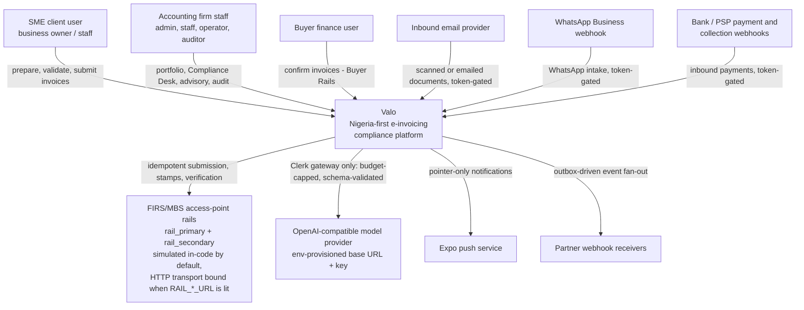
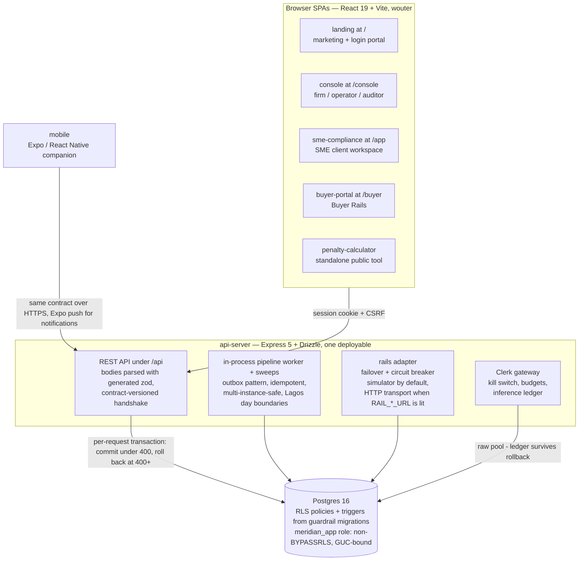

# Valo — architecture guidebook

The visual maps and the decision log: the two things `docs/platform.md` and
`docs/clerk-ai.md` (deep prose) and `CLAUDE.md` (the lean index) don't carry.
Level of detail follows the C4 idea — context first, then containers; the
component story is told by the code itself (`artifacts/api-server/src/modules/`
is packaged by component, one directory per responsibility).

This document is kept honest by
`artifacts/api-server/src/architecture-conformance.test.ts`: every workspace
package must be named here, and the structural sections below must exist.
Adding a package or making a significant decision means updating this file in
the same change — the suite fails otherwise.

## Context — Valo and its world

Reading notes, in the order the diagram surprises people:

- **The rails are simulated by default.** `modules/rails/adapter.ts` presents
  one adapter interface over two accredited access-point rails and exercises
  the full contract (idempotent submission, deterministic sandbox stamps,
  verification, failover, circuit breaker) without a real MBS/APP endpoint.
  Behind the same `RailTransport` seam sits an HTTP transport
  (`modules/rails/transports/http.ts`, a provisional access-point profile)
  that is bound only when `RAIL_PRIMARY_URL` / `RAIL_SECONDARY_URL` is lit —
  going live is an environment change, and callers don't change. Until a
  URL is set the simulator answers, and every diagram of this system that
  omits the word "simulated" is lying.
- **Every machine rail fails closed.** The inbound email, WhatsApp and
  payment/collection webhooks are token-governed: token unset means the rail
  is dark, not open.
- **The model provider is reachable from exactly one place** — the Clerk
  gateway (`modules/clerk/gateway.ts`): kill switch, per-firm monthly budget
  checked before the provider is touched, append-only inference ledger,
  schema-validated output, fail closed.
- **Outbound content is pointer-only** (SEC-12) and consent-gated (CORE-03):
  push and messaging templates never carry amounts, names or TINs.

## Containers — what actually runs

- The api-server **serves the five web bundles itself** at their `BASE_PATH`
  prefixes — one origin, one session cookie, one deploy. `info.version` from
  the contract is baked into server and bundles; `/api/healthz` returns the
  server's copy and the apps show a stale-build banner on mismatch.
- **The RLS boundary is the tenancy model.** Every request runs as the
  non-BYPASSRLS `meridian_app` role inside a per-request transaction with
  `app.firm_id`/`app.bypass` GUCs bound to the principal. Firm isolation is a
  database property; sibling-**client** isolation inside a firm is not (see
  D2 and SEC-03 in `CLAUDE.md`).
- **There is no external queue.** Background work is the in-process pipeline
  worker plus registered sweeps over an outbox table (see D1).

## Workspace packages

Runtime containers above; everything else is build-time. The conformance test
requires every package named here.

| Package                                    | What it is                                                                                                                                      |
| ------------------------------------------ | ----------------------------------------------------------------------------------------------------------------------------------------------- |
| `@workspace/api-server`                    | Express 5 + Drizzle data spine and rails (the one deployable).                                                                                  |
| `@workspace/landing`                       | Marketing site + login portal at `/`.                                                                                                           |
| `@workspace/console`                       | Firm/operator/auditor web app at `/console`.                                                                                                    |
| `@workspace/sme-compliance`                | SME client web app at `/app`.                                                                                                                   |
| `@workspace/buyer-portal`                  | Buyer Rails web app at `/buyer`.                                                                                                                |
| `@workspace/penalty-calculator`            | Standalone public tool.                                                                                                                         |
| `@workspace/mobile`                        | Expo / React Native companion.                                                                                                                  |
| `@workspace/db`                            | Drizzle schema, guardrail migrations, RLS context helpers.                                                                                      |
| `@workspace/api-spec`                      | `openapi.yaml` — THE contract — plus codegen (orval).                                                                                           |
| `@workspace/api-zod`                       | GENERATED request/response zod. Never hand-edit.                                                                                                |
| `@workspace/api-client-react`              | GENERATED react-query hooks. Never hand-edit.                                                                                                   |
| `@workspace/format`                        | Shared formatting (naira, dates, WHT copy).                                                                                                     |
| `@workspace/api-errors`                    | Shared error envelope helpers.                                                                                                                  |
| `@workspace/web-ui`                        | Shared workspace UI (command menu, metrics, shortcuts, recents).                                                                                |
| `@workspace/web-config`                    | Shared Vite config for the five web apps.                                                                                                       |
| `@workspace/integrations-openai-ai-server` | The provisioned OpenAI-compatible client (base URL + key from env); imported only by `modules/clerk/provider.ts`, the gateway's provider layer. |
| `@workspace/scripts`                       | e2e harness (Playwright), ux-snapshot, ops (backup/restore drill).                                                                              |

## Dependency checks

`pnpm run architecture:check` parses source imports with TypeScript rather
than matching import-like text in comments and strings. It resolves relative
imports, each package's inherited `tsconfig` aliases, and workspace package
exports, including subpaths, wildcard exports and import/require conditions.
Workspace resolution uses the source package manifests, not pnpm symlink state.
Type-only dependencies remain in the graph. CommonJS `.cjs` and `.cts` sources,
literal `require()` calls and literal lazy imports are included.

The gate rejects cycles and unresolved local source imports. It also traces
browser/mobile dependencies through shared barrels to prevent server-only
imports, rejects domain-to-route dependencies through aliases or intermediate
modules, and keeps model SDK access behind `modules/clerk/provider.ts`.
Third-party packages and stylesheet/media/data imports are not source-graph
edges. Computed module names are not evaluated; this check complements, rather
than replaces, type checking, build verification and runtime tests.

### Pipeline ownership

`modules/pipeline/pipeline.ts` is the compatibility facade, not an owner of
mutable state. Existing callers continue to use its public exports.

| Module | Responsibility |
| --- | --- |
| `submission.ts` | Invoice preparation, rail calls, stamp persistence and finalization. |
| `handlers.ts` | One shared registry for other outbox event handlers. |
| `leases.ts` | Claiming, lease ownership checks and heartbeat renewal. |
| `processing.ts` | One-event processing and atomic outcome bookkeeping. |
| `reconciliation.ts` | Recovery of stuck submissions and held stamps. |
| `queue-queries.ts` | Retry/dead-letter views, replay, retention and gauges. |
| `policy.ts` | Retry horizons, backoff and transaction/lease timing policy. |
| `scheduler.ts` | Worker lanes, scheduled passes, stop/resume and built-in sweep registration. |

Internal modules import their direct owners, never the facade. Authority I/O
stays between short database stages; finalization retains its lease fence and
atomic writes. The concurrency, fault-matrix, soak and scheduled-work tests
exercise the unchanged facade, while module-boundary tests pin shared registry
identity and the placement of transaction-free I/O.

### Claims page ownership

`pages/clerk-claims.tsx` remains the route entry and compatibility export for
existing helpers. Its `clerk-claims/` directory owns the form, facts editor,
detail view, register, gaps, dialogs and drafting panels. `use-clerk-claims.ts`
owns the React Query requests and workflow state; helpers/types are leaves so
components never import back through the page. Maker-checker decisions,
kill-switch handling, dirty-text confirmation and pending-action guards retain
their existing behavior and are covered by component and request-lifecycle tests.

## Decision log

Significance measured by cost of change: these are the decisions you cannot
refactor in an afternoon. Format: context → decision → consequences. New
significant decisions get an entry here in the same change that makes them.

### D1 — One deployable, in-process worker, no external queue

Context: background work (submission pipeline, verification, digests, sweeps)
needs ordering, retries and multi-instance safety; the team is small and the
deployment target (Replit workflow) is a single Node process that may scale
sideways.
Decision: a monolith with an in-process pipeline worker and registered sweeps
draining an **outbox table**, idempotent and multi-instance-safe, with Lagos
day boundaries computed in SQL.
Consequences: no broker to operate; every sweep must be written idempotently;
horizontal scale is safe but work sharding is coarse. Moving to a real queue
later is an adapter swap around the outbox, not a rewrite.

### D2 — Firm-keyed RLS with GUC-bound per-request transactions

Context: multi-tenant isolation for accounting firms had three candidate
shapes: schema-per-tenant, app-layer filtering only, or row-level security.
Decision: one schema, Postgres RLS enforced for the non-BYPASSRLS
`meridian_app` role, with `app.firm_id`/`app.bypass` GUCs bound per request
inside a transaction (`tenantContext`).
Consequences: firm isolation is a database property that survives application
bugs. But RLS shares a firm across all its `client_user`s, so sibling-client
isolation (SEC-03) must ALSO be asserted in routes
(`assertClientPartyScope`/`clientPartyScope`) — RLS is not a backstop there.
Tests need the guardrail migrations applied or they hit permission-denied.

### D3 — The 4xx rollback rule (and the raw-pool exception)

Context: handlers that partially wrote and then errored were leaving
half-states behind.
Decision: `tenantContext` buffers the response and commits only when
`status < 400`; anything at 400+ rolls the whole request back.
Consequences: handlers are atomic by default. Anything that must persist even
when the handler fails — login throttle counters, the Clerk inference ledger
(spend accounting must survive any rollback) — must write on the **raw
`pool`**, never `getDb()`. That exception list is small and deliberate.

### D4 — Contract-first with generated clients and a build handshake

Context: five web apps and a mobile app against one API; drift between server
parsing and client expectations is the classic failure.
Decision: `lib/api-spec/openapi.yaml` is the source of truth. Codegen produces
`api-zod` (the server parses every body/query/params with it) and
`api-client-react` (the apps call only these hooks); CI fails on any drift.
`info.version` is baked into server and bundles as a build handshake with a
stale-build banner.
Consequences: contract changes are one edit + regeneration; hand-editing
generated packages is forbidden; every contract change bumps the version.

### D5 — Two-channel schema management: `drizzle push` + guardrail migrations

Context: drizzle push is convenient for tables but cannot express RLS
policies, triggers, or FORCE ROW LEVEL SECURITY.
Decision: historical scratch bootstrap uses `drizzle push`; RLS policies/triggers
come from numbered migrations in `lib/db/src/migrations` with rollback tests.
New production fields and tables use reviewed additive versioned SQL, including
their constraints, grants and policies. The historical registry is not a complete
schema history and must not be treated as a generic schema conversion.
Consequences: a new tenant table is not done until its policy migration
exists; scratch databases need push THEN migrate, in that order; production
table changes require reviewed schema changes applied by Replit's native
Publish flow before artifact promotion;
`ops:release` refuses schema drift instead of pushing against serving traffic.
An explicit offline bootstrap requires drained writers and retains maintenance
on failure. Every production
boot applies the hand-written guardrail migrations idempotently under an
advisory lock and then verifies coverage before readiness. The manual
`@workspace/db migrate` command is for local/disposable setup and explicit
recovery procedures, not the normal production Publish path; boot is the
fail-closed safety net for RLS, trigger, and index guardrails that native
Publish cannot express.

### D6 — Prefix-mounted SPAs on one origin

Context: five separate frontends could each have had their own host.
Decision: every bundle builds with a `BASE_PATH` and the api-server serves
them all from one origin (`/`, `/console`, `/app`, `/buyer`,
`/penalty-calculator`).
Consequences: one session cookie, no CORS surface, one deploy and one
version-skew story; the cost is that a server restart is required for any
bundle to ship (see `CLAUDE.md` deployment notes) and per-app CDN routing is
off the table for now.

### D7 — One rails adapter, simulated until accredited; the HTTP transport is bound only when a rail URL is lit

Context: FIRS/MBS access-point accreditation is pending, but the whole
lifecycle (submit → stamp → verify) had to be real for users and tests — and
the first real access point had to be reachable without touching the
pipeline, the recovery paths or the UI.
Decision: a single adapter interface over two rails with deterministic
canonical-payload-derived stamps, idempotent submission, failover and a
circuit breaker, behind a `RailTransport` seam resolved per call in three
tiers — a bound transport (tests), the HTTP transport when
`RAIL_PRIMARY_URL` / `RAIL_SECONDARY_URL` is lit, else the in-code
simulator. The HTTP transport speaks a provisional profile and maps every
wire outcome onto the failure-class vocabulary, so the pipeline never sees
HTTP — a lookup the rail leaves unanswered raises, and the pipeline retries
rather than fails the invoice; a rail URL is vetted (https, or http to
loopback only; no credentials in it) before it lights anything; a transport
serves only the rails it has a URL for, and failover, recovery and the
"full outage" test count served rails only.
Consequences: the platform's callers, tests and UI are already shaped for
the real thing, and going live is an environment change — a URL, a token,
`RAIL_ENVIRONMENT=live` — not a code change; the Desk names the transport
and environment on every rail line. The rails are simulated until that URL
is set, and the word "simulated" must travel with every architecture claim
until then.

### D8 — Clerk gateway as the single model choke point

Context: an AI assistant touching financial records needs auditable spend,
provable grounding and an off switch.
Decision: every model call flows through `modules/clerk/gateway.ts`: `clerk_ai`
kill switch, per-firm monthly token budget checked before the provider and
again in the gateway, append-only inference ledger on the raw pool,
schema-validated output, fail closed. Facts are computed in SQL; the model
only classifies or phrases; a deterministic template fallback always answers.
Consequences: no feature may import the provider client directly
(`integrations-openai-ai-server` is imported only by the gateway's provider
layer, `modules/clerk/provider.ts`); model outages degrade to templates
instead of errors; spend is accountable per firm.

### D9 — Launch posture as a flag manifest with per-route gates

Context: launching with the full surface lit was too much risk; env-var flags
rot and can't express "dev-lit, launch-dark".
Decision: a `RELEASE_FLAGS` manifest (`modules/flags/releases.ts`) with
`launchDefault`/`devDefault` per flag, enforced by per-route `requireFlag`
gates (never whole-router `router.use` — routers mount prefix-less, so a
router-level gate intercepts unrelated routes), surfaced to clients via
`Me.features`, and pinned by a posture test that counts gates per file.
Consequences: a fresh production database lights exactly the R0 core; turning
a feature on is a deliberate manifest + posture-test change; client nav hides
what the API would 404.

### D10 — Fail-closed machine rails, pointer-only outbound

Context: webhooks and notifications are the two places data walks in or out
without a human session.
Decision: inbound rails (email, WhatsApp, payments/collections) are dark
unless their token is configured; outbound messages and push notifications
are consent-gated (CORE-03) and pointer-only (SEC-12) — template copy plus an
opaque reference, never amounts, names or TINs.
Consequences: a misconfigured deployment leaks nothing and receives nothing;
notification depth is limited by design (the app is the place to read
details).

### D11 — Statutory time lives in SQL on the Lagos calendar

Context: deadlines, months and "overdue" are legal facts; computing them in
JavaScript across processes invites boundary bugs.
Decision: statutory clocks (VAT months, filing deadlines, day boundaries) are
computed in SQL against the Lagos calendar, and every derived figure the UI
shows states its basis.
Consequences: one source of truth for "what day is it"; UI code formats but
never re-derives statutory state; tests pin the boundary behaviour.

### D12 — Per-staff client assignment narrows the view, never the boundary

Context: the console shows every firm user the whole portfolio. The staff
workspace design (September 2026 mockups) assumes "my clients"; firms with
more than a few staff want that partition, but the launch-profile firms are
small and RLS is keyed on the firm, not the person.
Decision: add a firm-scoped assignment table (staff user ↔ client party) in
its own round. Unassigned clients stay visible to everyone (default-open);
assignment drives the default "My clients" filter and the work queue, and
firm admins always see everything. It is a convenience partition, not a
security boundary — RLS (D2) and SEC-03 remain the only isolation.
Consequences: no change to RBAC capabilities or RLS policies beyond the new
tenant table's own policy migration; assignment changes are audited like
any other firm action; the staff workspace gains a "My clients / All
clients" switch rather than a second portfolio page.
Status: shipped in R72 — `client_assignments` (firm-keyed, policy migration
0045), `GET/PUT /console/clients/{id}/assignments` (firm admin, audited),
`ClientRisk.assignedUserIds`, and the console's "My clients / All clients"
scope (assigned to me or unassigned; admins default to all).

### D13 — One session is one workspace; the header chip is a label

Context: the SME mockups show a business switcher in the header. A
`client_user` is scoped to one `clientPartyId` at sign-in (the SEC-03 scope
is a property of the principal, not of a UI selection), and firm users reach
a client through the console.
Decision: no multi-business switcher. The header chip names the workspace
(`Me.workspaceName`: the client business, else the firm) and does not
switch it. An owner of several businesses gets one invitation per business.
Consequences: SEC-03 stays a one-line predicate; the SPA cannot serve one
client's cached queries under another; if a switcher is ever built it is a
re-authentication (a new session), never a client-side filter.

### D14 — No SSO in the launch window; access review as reporting, later

Context: the team-and-access mockup shows SSO and periodic access reviews.
Launch firms are Nigerian SME practices whose identity posture is the local
password plus TOTP (`TOTP_REQUIRED_ROLES`), and the platform has a single
auth code path.
Decision: no SAML/OIDC federation before the credit-perimeter releases. An
access review is a small later round built on what exists — an exportable
"who has access, since when, last sign-in" register plus a firm-admin
attestation recorded on the audit chain — scheduled after D12 so it can
report assignments too.
Consequences: one identity path to test and rate-limit; MFA enforcement stays
environment-driven; the review round is reporting and attestation only, and
must not grow an identity-provider dependency.
Status: shipped in R73 — `GET /console/access-register` (+ CSV) lists every
member with role, since-when, last sign-in (from the `auth.login` audit
events), MFA state and client assignments; `POST
/console/access-register/attest` records a firm admin's attestation on the
audit chain against the register's hash (stale hash → 409).

### D15 — Consent capture gates the first landing; Consent stays in the nav

Context: CORE-03 makes recorded consent the basis for anything the platform
sends, but the consent ledger is a page an owner may never open. The
onboarding mockup captures consent at first login. Layer 3 (credit readiness)
has a separate purpose and must never be bundled into operational consent.
Decision: after activation, the first landing shows a one-time, resumable
consent step before the workspace — layers 1 and 2 as explicit choices,
with layer 3 explained but deferred to its full, separate Consent-page choice
so it is never a silent default. Declining is allowed and recorded. The Consent page keeps its
first-class nav entry so decisions can be revisited. Built as its own round
(a contract change to expose "consent captured" and the landing
interstitial).
Consequences: outbound rails find a consent record from day one; the
interstitial can never block a returning user (one-time by design); layer 3
can be revoked immediately and its copy describes readiness and protected
aggregation, never financing.
Status: shipped in R71 — `Me.consentCaptured` (an explicit layer-1 decision
exists, grant or recorded decline), the SME app's `RequireConsentCapture`
gate and its `first_landing` consent events.

### D16 — The design system is a refresh of the existing shell, not new apps

Context: ten screen mockups (September 2026) proposed a new visual language
for the SME, console, operator, auditor and onboarding surfaces. Verifying
them against the code showed most of their structure already exists; what
differed was palette, typography, the shell, and a handful of navigation
calls.
Decision: adopt the mockups as tokens plus shell. `@workspace/web-ui` owns
the `--mi-*` palette, the metric tiles and the `.mi-sidebar` / `.mi-topbar`
classes; sme-compliance and console render their sidebars and headers on
those classes and retone their theme variables to match. Buyer portal keeps
its own blue. Page bodies are restyled incrementally, one round at a time,
against screenshots and the accessibility check. Navigation calls made with
the shell: the SME home is "Today" (not "Dashboard"); Help sits in the
header and the sidebar footer; the stamped-invoice vault is the Invoices
list filtered to Stamped, not a separate entry; the Control centre stays in
the operator nav; the auditor badge reads "Read-only auditor"; the Release
badge is derived from `Me.releaseTag` — the highest release whose every flag
at that tag and below is lit (R0 floor), computed by
`activationReleaseTag` from the flag manifest — never hard-coded.
Consequences: a palette change lands in every app at once; the release badge
cannot drift from the activation posture (D9); remaining page-level
differences from the mockups are tracked in the UX backlog rather than
rebuilt wholesale; D12–D15 are the product decisions those screens forced,
each with its own round.

### D17 — Pilot cohorts are audited overrides; a flag that gates nothing is retired

Context: the manifest promised that "a per-firm override activates a named
pilot", but the override was a bare upsert with no listing, no reason, no
actor and no audit row, and one R1 flag (`stamp_verification`) gated no
route while still blocking the R1 badge.
Decision: a firm's pilot membership is a first-class override with a
required reason and the setting user, listable per flag, clearable (which
is not the same as an explicit "off"), and every change — including the
platform-wide flip — lands on the audit chain naming the actor and the
target firm. Public stamp verification is R0 core (it is the QR link on
every stamped PDF), so its flag is retired: `RETIRED_FLAGS` names it, the
seed removes the row, and the posture tests pin the retirement.
Consequences: the console shows who is in a pilot and why; an activation
decision is reconstructible from the ledger; the R1 badge is reachable by
lighting the six R1 capabilities that exist; a retired key can never be
re-seeded by accident.

### D18 — Machine rails authenticate with signed, rotatable key rings

Context: each machine rail (D10) was governed by one static shared secret
presented verbatim in a header — unrotatable without downtime, replayable
against any rail that shared it, and invisible to the operator except as a
presence boolean.
Decision: every rail reads a per-rail key ring (`X_KEYS` = `id:secret,…`,
the session-signing shape) with the old single token as the `legacy` key;
callers sign requests (key id, timestamp inside a replay window, HMAC over
method, path and the exact body bytes). The plain-token compatibility path is
off by default in production and requires `OP_LEGACY_TOKENS=on` during a
time-bounded migration; the rail-config surface shows key ids only; the
e2e collections journey rides the signed path.
Consequences: keys rotate by adding then removing ring entries; a captured
credential is bound to one rail, one payload and a few minutes; providers
migrate on their own schedule; the fail-closed posture of D10 is unchanged
(an empty ring is a dark rail).

### D19 — A rail outage is sat out, never dead-lettered through

Context: six attempts of doubling backoff gave a submission about two
minutes before dead-lettering, reconcile re-queued a fresh row beside every
dead one each pass, and each failed breaker probe re-stamped the outage
start — so a real outage would have produced an unbounded stream of dead
rows, alerts and Desk cases.
Decision: retriable failures retry under a wall-clock horizon with capped,
jittered backoff; when every breaker is open the submission parks (no
attempt burned, nothing recorded as sent) until the breaker's retry-at; the
breaker keeps its outage start and re-arms retry-at only, so one probe runs
per cooldown and one alert per outage; a dead row is terminal until an
operator replays it; outbox depth, age and dead counts are gauges.
Consequences: an outage shorter than the horizon costs nothing but delay;
a longer one leaves a dead-letter queue the operator drains with replays
after the rail returns; the runbook in the manual describes the signs and
the one deliberate action.

### D20 — A conformance fake rail, not a mock, proves the transport

Context: the HTTP transport is the first rails code that leaves the process,
and a mocked `fetch` would prove only that the code calls what the test
expected; the in-code simulator cannot produce the one case the duplicate
path exists for — a rail that really holds a stamp for a re-sent key — and a
scenario scripted in a pipeline test had no guarantee of meaning the same
thing on the wire.
Decision: one fault table (`modules/rails/faults.ts`) shared by the HTTP
transport, an in-process scripted fake (the test double every adapter and
pipeline suite binds) and a `node:http` conformance fake rail that speaks
the wire profile on a real socket, remembers accepted submissions, enforces
the bearer and takes scripted faults per invoice through loopback control
endpoints; the transport's tests run against it in-process and the e2e
harness spawns it so a whole run stamps over HTTP. Only a submit probes an
open breaker — a lookup never moves an open breaker forward, though a
lookup the rail cannot answer counts as a failure on that rail and sends
the event back to retry — and the rail call stays inside the worker's
bypass transaction, bounded by `RAIL_TIMEOUT_MS` per call with at most four
calls per event (the session's idle-in-transaction timeout is pinned to
that budget).
Consequences: every fault-matrix cell is pinned at the wire, at the
classified result and at the pipeline disposition by tests that cannot drift
from one another; a real access point is adapted in one file; the e2e run
proves boot-time transport selection instead of assuming it; the two
retriable codes it added (`RAIL_UNAUTHORIZED`, `RAIL_PROTOCOL`) mean a bad
credential or a garbled answer costs delay, never a failed invoice — and so
does a stamp lookup the rail leaves unanswered.

### D21 — Breaker bookkeeping is autocommit, and the half-open probe is a slot

Context: R95 left the breaker writes inside the worker's event transaction,
so a second worker's gate queued behind the first worker's rail call, two
workers failing over in opposite orders could deadlock, and a rolled-back
try forgot the failure the rail really produced; the rail alert carried no
error code and nothing on the Desk showed a submission that was still
retrying.
Decision: every breaker write is one short autocommit statement on the raw
pool (the same posture as the login throttle and the inference ledger); the
half-open probe is claimed atomically by exactly one worker with a lease,
taken over once the lease passes; `recordFailure` counts, opens or re-arms
in one statement and keeps the last error code; the alert evidence, the
rails card and a new retrying-events card carry it; a seeded soak over two
conformance fake rails with concurrent workers pins the invariants.
Consequences: no event transaction locks `rail_states`; a failure survives a
rollback (the correct memory for a breaker); an operator distinguishes a
refused credential from an outage on the alert; multi-instance workers
share one probe per cooldown; and the soak is the regression net for every
later change to the pipeline's concurrency.

### D22 — Today is a read model; collaboration is a guarded ledger

Context: each role had capable domain pages but no single answer to "what needs
attention now", global search stopped at page names, and coordination escaped
into messages with no tenant-scoped owner, deadline or decision history.
Decision: compose Valo Today at request time from the authoritative invoice,
filing, obligation and work ledgers; keep universal search role- and tenant-
scoped in SQL; persist human coordination in `work_items` and append-only
`work_item_comments` with idempotent creates and optimistic versions. Client
scope remains a server predicate, never a UI filter. The browser may persist an
unsent draft and retry id, but never a second authoritative copy of work state.
Consequences: the home screen cannot drift from domain records; a lost response
does not duplicate work; concurrent edits conflict visibly; collaboration can
be audited without moving compliance evidence out of its owning tables.

### D23 — Live data providers terminate at deployment-owned relays

Context: sandbox ERP and bank connectors proved mapping and cursor behavior but
did not establish a production credential boundary, and raw JSON configuration
made setup inconsistent and error-prone.
Decision: live ERP and bank adapters call only deployment-owned, HTTPS relay
URLs with server-side tokens. Tenant input is limited to connector-declared,
bounded string fields; live rows store a non-secret account reference. The UI
renders those declared fields, requires a connectivity test before save, and
labels sandbox versus live readiness explicitly. Provider round trips used only
for testing execute outside tenant transactions; workers authenticate again
before every pull.
Consequences: connection forms cannot turn the API into an SSRF proxy or expose
vendor secrets; OAuth and token rotation stay at the relay; source code can ship
the integration boundary but cannot truthfully claim a provider is live until
deployment secrets, accreditation and an observed sync exist. The wire contract
and rollout checklist live in `docs/workspace-and-provider-readiness.md`.

### D24 — Credit readiness is a governed evidence product, not financing

Context: the R3 roadmap calls for a credit data layer and bank pilot while R4
contains origination, pricing, funding and repayment. Reusing the dormant v0
assessment table or exposing invoice-level records would blur that boundary,
make historical decisions unreplayable and create a cross-tenant disclosure
risk.
Decision: R3 writes an additive `credit_eligibility_assessments` ledger. A
versioned, deterministic rules engine requires a canonical stamp, buyer
confirmation plus no-set-off, approved settlement observation and current KYB;
caps and deterministic fraud/concentration signals produce an auditable rule
trace. Layer-3 consent is checked before KYB or assessment. Bank users receive
only `credit.data_room.read`; every request also requires TOTP, the latest
append-only DPA grant and an unexpired access window. Their fixed-query Data
Room shares quarterly, fixed-amount-band cohorts only when at least five
distinct consenting businesses occupy a cell. It never returns business
identifiers, exact amounts, arbitrary filters or raw exports, and every view is
logged. Activation stays dark until the operator's governance view records the
pilot population, DPIA, conditional bank MOU, agreed signed collection feed,
governed bank user and a passing structural replay.
Consequences: retries cannot duplicate evidence, consent revocation removes a
business from subsequent aggregates, policy changes cannot rewrite history and
the bank surface cannot be used as a general cross-tenant console. Structural
back-tests prove deterministic replay only; they do not claim loss prediction.
The legacy `eligibility_assessments` table is retained and locked bypass-only so
production rollout is additive. R4 financing tables have no route or UI and
remain bypass-only.
Status: landed in API contract `0.98.0` behind the dark `credit_readiness` and
`bank_data_room` flags; activation evidence remains operational work.

### D25 - Request policy is one security boundary

Context: transaction exemptions and model-capacity classifications were split
between app and rate-limit middleware, making drift possible.
Decision: one import-free policy catalogue owns route matching and tenant-bypass
role classification; middleware consumes pure predicates and posture tests pin
every exception.
Consequences: a route cannot silently change transaction or model-rate posture
in one middleware only. Every exemption remains an explicit reviewed decision.

### D26 - Clean builds use checked-in web profiles

Context: a clean root build failed unless deployment supplied five pairs of
port/base-path variables, and recursive build pulled in Expo hosting concerns.
Decision: each web app declares its canonical path and local port; validated
environment overrides remain available. Mobile has a separate build command.
Consequences: local and CI web/API builds are deterministic, while environment-
specific mobile packaging remains explicit.

### D27 - Structural debt has executable gates

Context: six import cycles and unmeasured boundary drift increased change risk.
Decision: zero cycles, browser/server separation, domain/route direction, Clerk
provider ownership, and high-confidence secret hygiene run in the main check.
Consequences: architectural erosion fails early; legacy size, duplication, and
formatting debt is measured and handled through a ratcheted debt register.
